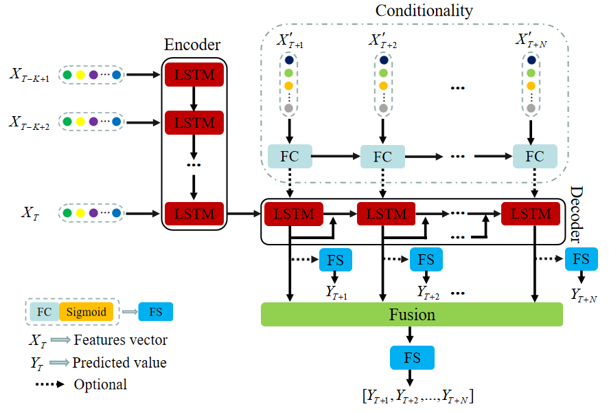

# lstm-time-series-forecasting
Use lstm to solve problem of  time-series-forecasting


### 程序启动
python train/trainer.py
### 配置文件驱动
通过修改configs/lstm.yaml文件，驱动不同模型训练推理或者同一模型下不同参数的训练推理
```bash
Global:
  is_train: False
  epochs: 20
  save_model_dir: outputs/models
  ckpt_path: outputs/models/WMSELoss_8_4_epochs20.ckpt # 模型读取
  seq_len: 8  # 输入的时间步长
  output_size: 4
  spacing: 15 # 采样间隔，即每个采样点为15分钟
  print_batch_step: 100
  loss_fig_flush: 5 # loss图像刷新频率
  pretrained_model:


Optimizer:
  name: Adam
  lr: 0.005

Loss:
  name: WMSELoss

PostProcess:
  name:

PreProcess:
  name: LoadSingleStationData
  pv_excel_path: D:\project\draft\pv.xlsx
  weather_excel_path: D:\project\draft\weather.xlsx
  neighbour_point:
  need_col_name: ['ds', 'weather', 'humidity', 'pressure', 'realFeel', 'pop', 'temp', 'uvi', 'windDegrees', 'windSpeed', 'windLevel']


Metric:
  name: WMAPE
  main_indicator: wmape

Architecture:
  model_type: rnn
  algorithm: Seq2Seq
  hidden_size: 32
  num_layers: 2
  bidirectional: True

Train:
  dataset:
    name: LSTMDataSet
  loader:
    shuffle: True
    batch_size: 4 # 8
    num_workers: 0
    train_ratio: 0.9


Eval:
  start_time: '2022-09-5 00:00:00' # 预测起始时间
  end_time: '2022-09-15 23:45:00'  # 预测结束时间
  plt_show: True
  vpt: 200 # 小于该阈值采样点，不计入准确率统计
```
### 数据获取
为了便于跑通demo学习，同时考虑数据隐私性，这里提供了简化修改版的pv.xlsx和weather.xlsx下载链接
pv.xlsx 链接：https://pan.baidu.com/s/1-wATJALkV9j4UU6SS84MpA  
提取码：2twy  
weather.xlsx 链接：https://pan.baidu.com/s/1O7tCVWsJoDoSvPps1n_9Tw  
提取码：fraq  
通过configs/lstm.yaml在PreProcess中指定xlsx文件绝对路径
### 模型
在model/__init__.py中可查看当前已支持的模型百名单

- [x] lstm or bilstm
- [x] cnn-lstm
- [x] seq2seq
- [x] seq2seq fusion, 当前仅支持sum fusion   

可自定义模型类，然后手动添加到__init__.py白名单即可，在configs/lstm.yaml的Architecture中指定模型类别  
### 损失函数
在losses/__init__.py查看当前已支持losses函数
- [x] MAEZeroMaskLoss
- [x] MSEZeroMaskLoss
- [x] MAELoss
- [x] MSELoss
- [x] WMSELoss
- [x] WMAELoss

可自定义losses类，然后手动添加到__init__.py白名单即可，在配置文件Loss中指定

### 度量评价
- [x] WMAPE-β
### 优化器
- [x] SGD
- [x] Adam

### Global参数解释

```bash
is_train: False # 训练还是测试
epochs: 20 # 训练周期
save_model_dir: outputs/models  # 生成的模型文件保存路径
ckpt_path: outputs/models/WMSELoss_8_4_epochs20.ckpt # 测试时，模型加载读取路径
seq_len: 8  # 输入的采样步长
output_size: 4 # 待预测的采样步长
spacing: 15 # 采样间隔，即每个采样点为15分钟
print_batch_step: 100  # 训练信息显示设置
loss_fig_flush: 5 # loss图像刷新频率，即运行多少个epoch刷新本地已生成的loss图像
pretrained_model: # 预训练模型路径，可忽略
```


### 模型评估解释

```bash
Eval:
  start_time: '2022-09-5 00:00:00' # 设置预测起始时间
  end_time: '2022-09-15 23:45:00'  # 设置预测结束时间
  plt_show: True  # 是否显示预测和真值曲线对比图
  vpt: 200 # 对于真值本身小于该阈值采样点，不计入准确率统计
```


